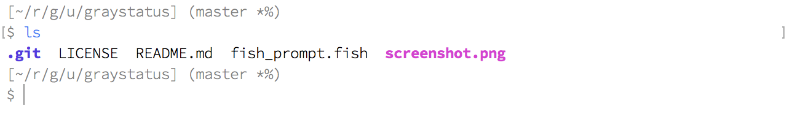

# graystatus

Prompt theme for [fish shell](http://fishshell.com).

* modest prompt
* deference to contents

## Screen Shot



## Install

If you use [fisherman](https://fisherman.github.io) :

```
fisher usami-k/graystatus
```

If you use [oh-my-fish](https://github.com/oh-my-fish/oh-my-fish) :

```
omf install graystatus
```

